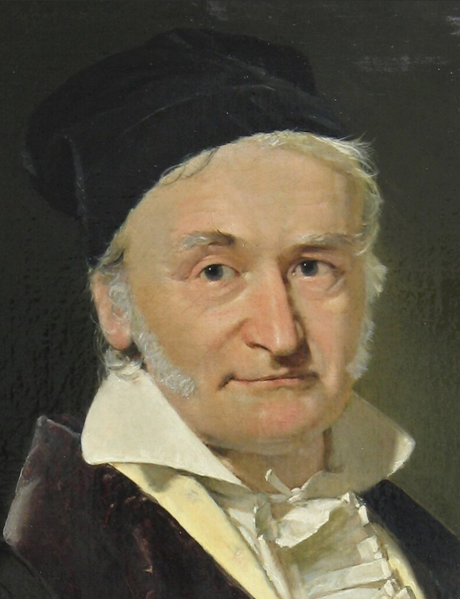
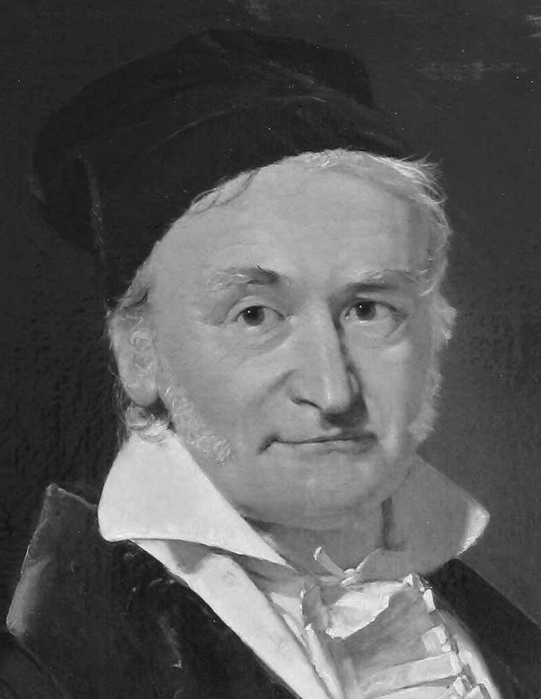
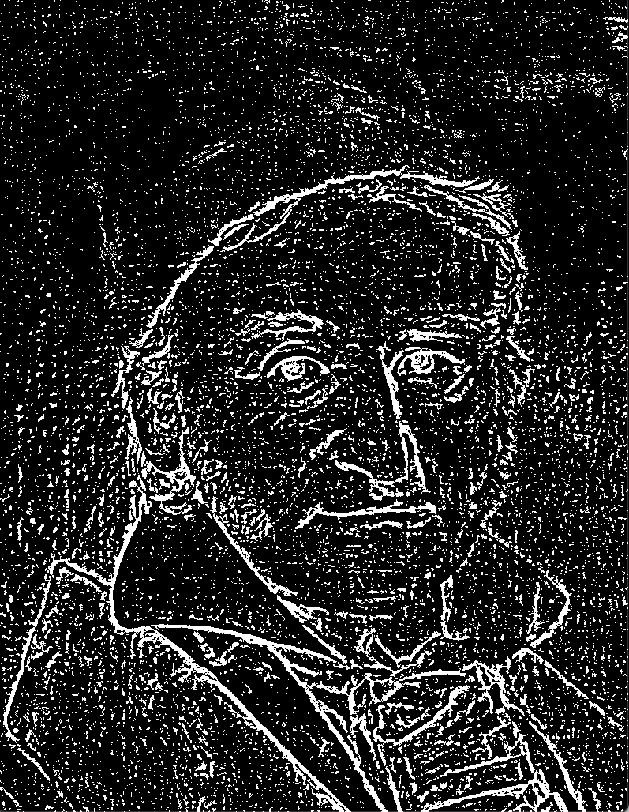
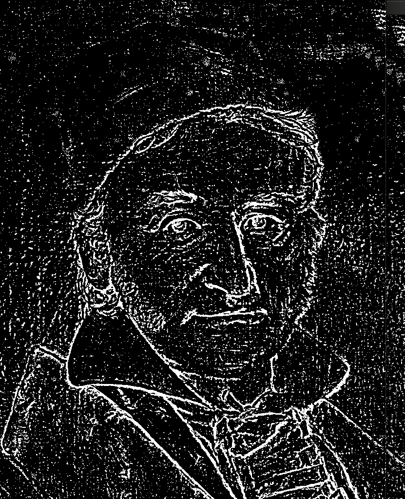

# Лабораторная работа №1
Вариант: Бинаризация с адаптивным порогом (по выбору – mean или gaussian)

## Теоретическая база
Бинаризация - процесс перевода цифрового изображения в изображение с бинарной цветовой гаммой, т.е. такое изображение, где каждый пиксель представлен одним из двух значений (0 или 1)

В качестве одного из методов бинаризации используют пороговую бинаризацию, т.е. значение каждого пикселя выбирается по результатам сравнения его исходного значения с некоторым порогом.

Простейшей пороговой бинаризацией является бинаризация с глобальным порогом, т.е порог выбирается заранее и каждый пиксель изображения сравнивается с одним и тем же значением

Таков метод плохо показывает себя когда объекты на изображении имеют широкий спектр цветов и оттенков (есть как темные, так и светлые элементы), можно потерять некоторые признаки объектов

Метод бинаризации с адаптивным порогом подразумевает определение порога для каждого пикселя отдельно на основании его соседей.
Например, порог можно определять как среднее значение блока пикселей вокруг заданного или по Гауссу, где вклад каждого пикселя-соседа прямо зависит от его близости к заданному пикселю.

## Описание разработанной системы

Система состоит из двух модулей:

- [главный модуль](main.py) - загружает в память изображение и вызывает модуль обработки, выводит результат на экран
- [модуль обработки](impl.py) - содержит две функции для обработки изображения: одна осуществляет бинаризацию с адаптивным mean-based порогом при помощи библиотеки opencv, другая - тот же метод, но нативно на Python

Обе функции имеют одинаковый набор параметров:
- image - матрица ч/б изображения, каждый пиксель имеет интенсивность от 0 до 255
- max_value - старшее бинарное значение пикселя (целое число)
- block_size - размер блока для вычисления порога конкретного пикселя - должен быть нечетным целым числом больше 1
- C - константа, вычитаемая из полученного порога
- inversion - булев параметр, отвечающий за инверсию результата сравнения с порогом (если False, то max_value будет установлен при превышении порога, иначе при недостатке до него) 

Таким образом для каждого пикселя берется окрестность размера (block_size - 1) // 2, в которой сам пиксель является центральным элементом блока, среднее его элементов и есть найденный порог

## Результаты работы и тестирования системы
Получены следующие результаты:
1. Оригинал изображения

2. Ч/б

3. Бинаризация CV (max_value=255, block_size = 11, C = 4, inversion = True)

4. Бинаризация нативная (max_value=255, block_size = 11, C = 4, inversion = True)

Скорость работы собственной имплементации отстает на 3 порядка от имплементации opencv засчет неоптимальной работы с матрицами (во время вычислений использовались обычные python-циклы)

- OpenCV: 0.007 с
- Native: 2.29 с 

## Выводы по работе
В рамках л.р. был изучен алгоритм бинаризации с применением адаптивного порога. 
Рассмотрена теоретическая часть метода, его преимущества над методом бинаризации с использованием глобального порога. 
Была протестирована реализация метода при помощи библиотеки OpenCV и выполнена собственная реализация алгоритма и произведено сравнение результатов и скорости работы алгоритмов.
## Источники
[Статья с небольшой теорией и примерами на OpenCV для бинаризации](https://pyimagesearch.com/2021/05/12/adaptive-thresholding-with-opencv-cv2-adaptivethreshold/)

[Официальная документация OpenCV по Image Thresholding](https://docs.opencv.org/4.x/d7/d4d/tutorial_py_thresholding.html)