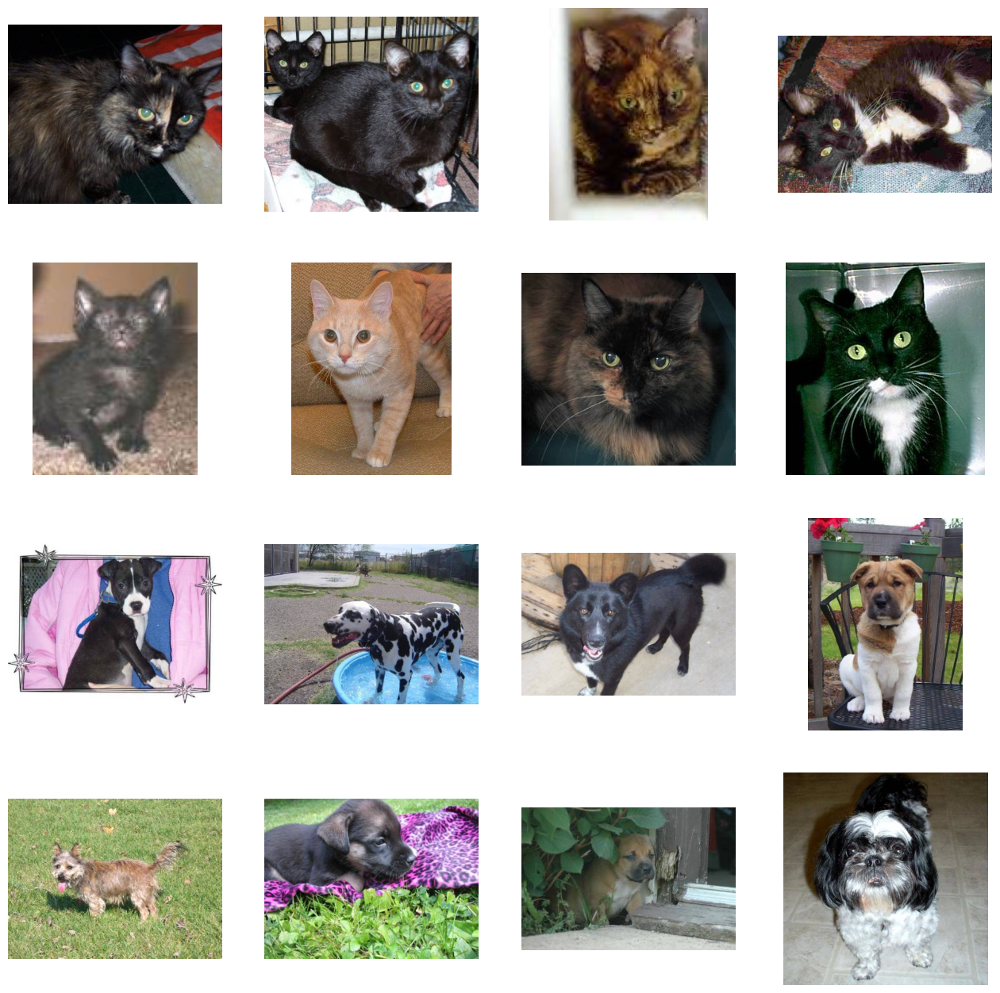
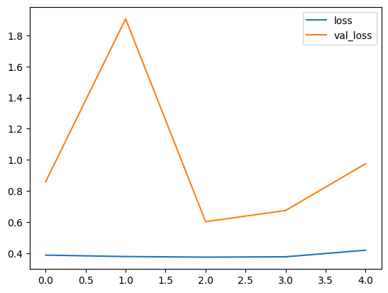
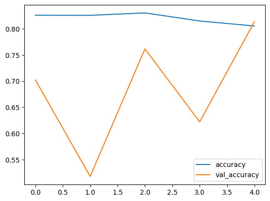
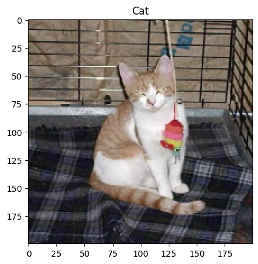
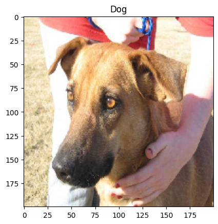

# Лабораторная работа №3

Классификация изображений на основе сверточных нейронных сетей

## Теоретическая база

### Классификация изображений

**Классификация изображений** — это задача компьютерного зрения, заключающаяся в определении категории, к которой принадлежит данное изображение. Эта задача имеет множество приложений, включая медицинскую диагностику, распознавание лиц, автономные транспортные средства и многое другое. Современные подходы к классификации изображений в основном основаны на использовании глубоких нейронных сетей, особенно сверточных нейронных сетей (CNN).

### Сверточные нейронные сети

Сверточные нейронные сети представляют собой специализированный тип нейронных сетей, предназначенный для обработки данных с сетчатой структурой, таких как изображения. Основные компоненты CNN включают:
* **Сверточные слои** (Convolutional Layers): Эти слои применяют фильтры (ядра свертки) к входным данным для извлечения признаков. Каждый фильтр обучается находить определенные паттерны или особенности в изображении, такие как края, текстуры и формы.
* **Слои подвыборки** (Pooling Layers): Эти слои уменьшают размерность данных, сохраняя наиболее важные признаки. Наиболее распространенным методом является максимальная подвыборка (Max Pooling), которая выбирает максимальное значение из области, охватываемой фильтром.
* **Полносвязные слои** (Fully Connected Layers): После извлечения признаков из изображения с помощью сверточных и подвыборочных слоев данные передаются в один или несколько полносвязных слоев. Эти слои принимают выходы предыдущих слоев и используют их для классификации.
* **Активационные функции**: Активационные функции, такие как ReLU (Rectified Linear Unit), используются для введения нелинейности в модель, что позволяет ей лучше обучаться на сложных данных.

## Описание разработанной системы

### Датасет

В качестве датасета был взят [Cat & Dog Classification](https://www.kaggle.com/datasets/subho117/cat-and-dog-classification-using-cnn)

Датасет состоит из 25000 изображений, 12500 - это кошки, 12500 - это собаки.

### Архитектура модели

```python
model = tf.keras.models.Sequential([
	layers.Conv2D(32, (3, 3), activation='relu', input_shape=(200, 200, 3)),
	layers.MaxPooling2D(2, 2),
	layers.Conv2D(64, (3, 3), activation='relu'),
	layers.MaxPooling2D(2, 2),
	layers.Conv2D(64, (3, 3), activation='relu'),
	layers.MaxPooling2D(2, 2),
	layers.Conv2D(64, (3, 3), activation='relu'),
	layers.MaxPooling2D(2, 2),

	layers.Flatten(),
	layers.Dense(512, activation='relu'),
	layers.BatchNormalization(),
	layers.Dense(512, activation='relu'),
	layers.Dropout(0.1),
	layers.BatchNormalization(),
	layers.Dense(512, activation='relu'),
	layers.Dropout(0.2),
	layers.BatchNormalization(),
	layers.Dense(1, activation='sigmoid')
])
```

* 4 слоя свертки + пулинга для определения более сложных признаков
* Полносвязные слои для обучения зависимостям
* Нормализация мини-пакетов для ускорения и улучшения стабильности сети
* Dropout для предотвращения переобучения
* Выходной слой с активацией сигмоиды (т.к. у нас бинарная классификация)

* В качестве метрики был выбран **accuracy**, т.к. датасет является сбалансированным
* В качестве функции потерь – бинарная кроссэнтропия

### Системные требования

Python 3.6+ и следующие библиотеки:

* numpy==1.23.5
* matplotlib==3.6.2
* pandas==1.5.3
* tensorflow==2.12.0

## Результаты работы и тестирования системы

### Пример датасета



### График loss



### График accuracy



### Примеры предсказаний





## Выводы по работе

В ходе данной лабораторной работы был реализован бинарный классификатор изображений с использованием сверточной нейронной сети.
Данная модель была протестирована на датасете кошек и собак, получив на валидационной выборке accuracy = 0.8136 и bce_loss = 0.9746.

Также были получены практические навыки в разработке и оптимизации сверточных нейронных сетей, а также понимание принципов работы CNN. Эти знания могут быть применены для решения более сложных задач в области компьютерного зрения и глубокого обучения. 

## Источники

* [Сверточные нейросети](https://education.yandex.ru/handbook/ml/article/svyortochnye-nejroseti)
* [Introduction to Convolution Neural Network](https://www.geeksforgeeks.org/introduction-convolution-neural-network/)
* [Python | Image Classification using Keras](https://www.geeksforgeeks.org/python-image-classification-using-keras/)
* [Cat & Dog Classification using Convolutional Neural Network in Python](https://www.geeksforgeeks.org/cat-dog-classification-using-convolutional-neural-network-in-python/)
